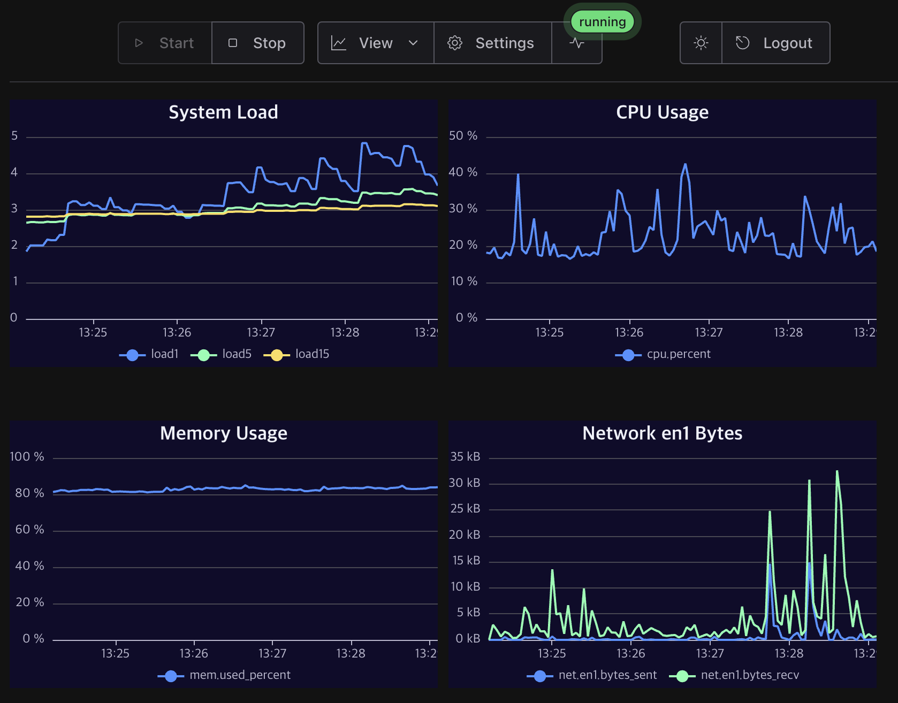

# neo-cat

machbase-neo's *watch-cat*, rather than *watch-dog*.

## Features
- [x] System load
- [x] CPU Usage
- [x] Memory Usage
- [x] Network IO
- [x] Disk Usage
- [x] Disk IO
- [ ] Network Protocol
- [x] machbase-neo statz

## Screenshot

